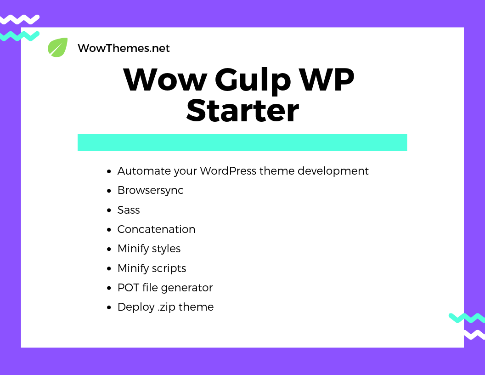

# Wow Gulp WP Starter

[Details](https://bootstrapstarter.com/bootstrap-templates/wow-gulp-wordpress-starter-theme/)



## Developers all around the world, automate your WordPress theme development with this starter blank theme: 

- Browsersync, 
- Sass, 
- concatenation, 
- style & scripts minify, 
- POT file generator, 
- .zip theme generator

### Installation

- Run `npm install`

- Open `gulpconfig.json`. Replace `proxy` link and project `name`:

The proxy link will is your usual default local WP  and the project name is the name of your theme (lowercase).

`"proxy": "http://localhost:8888/",`

```"project": {
    "name": "wowgulpwpstarter",
    "languagefolder": "./languages"
  }
```

### Generate this first

`css/theme.min.css` isn't available when first installed so you need to edit a file or run `gulp deploy` to generate it first. 

### Start developing

Run `gulp watch-bs` to open the live browser with *watch*. Now you can edit your theme and watch live changes.

### Production

Run `gulp deploy` to generate theme.zip in `dist` folder. 

### Credits

Inspired by Understrap

### Contribute

- Fork project
- Clone your fork to local directory
- Write and commit changes
- Push to your forked repo
- Submit a pull request from forked repo back to main repo and describe your changes.

### A project by Sal @wowthemes

[Buy me a coffee](https://www.wowthemes.net/donate)

Thank you!
